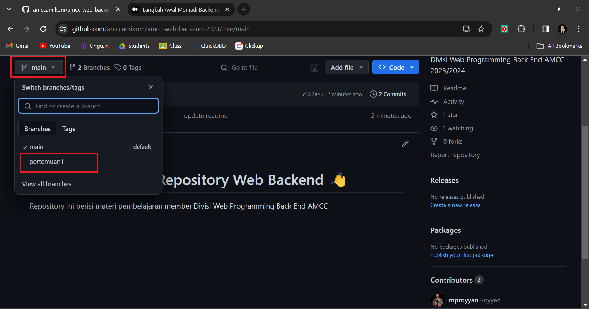
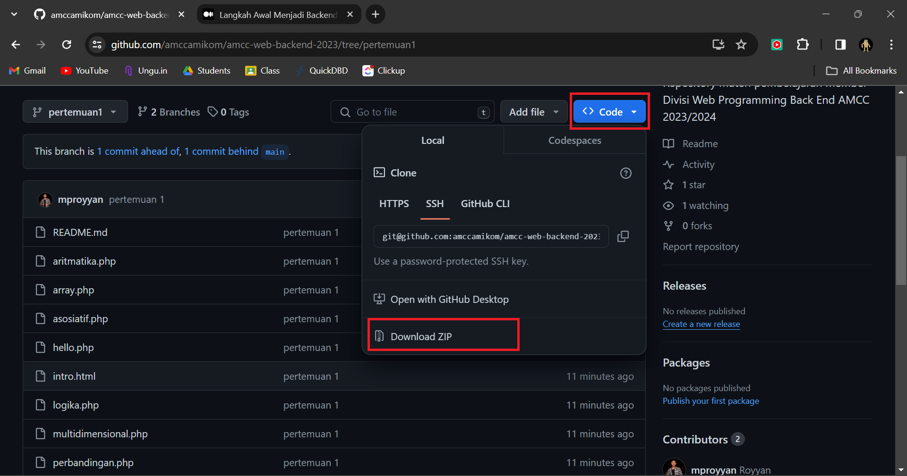

# Selamat Datang di Repository Web Backend 👋

Repository ini berisi materi pembelajaran member Divisi Web Programming Back End AMCC

# Cara Download

Untuk teman teman yang tidak berangkat pada pertemuan tertentu karena suatu alasan dan merasa tertinggal dengan yang lainnya. Tenang saja kami sudah menyiapkan hasil hasil praktikum pada tiap tiap pertemuan, jadi teman teman tinggal download saja. Cara mendownload ikuti langkah langkah berikut ini :

1. Klik tombol yang ada di pojok kiri atas lalu pilih pertemuan berapa yang teman teman ingin download misal ingin mendownload hasil praktikum pada pertemuan pertama maka pilih `pertemuan1` dan seterusnya 

2. Setelah memilih pertemuan selanjutnya klik tombol warna biru bertuliskan `Code` di pojok kanan atas lalu klik `Download ZIP` 
