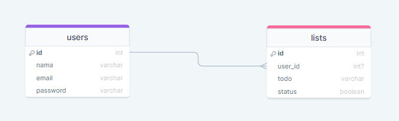
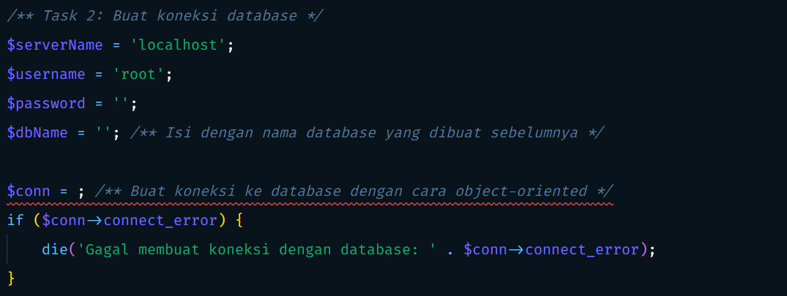
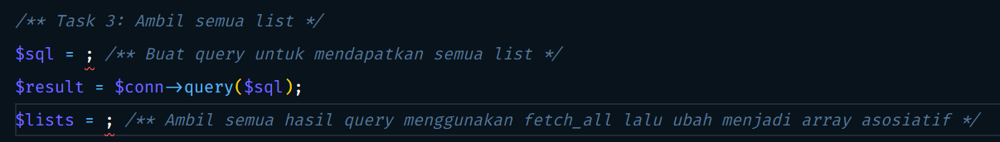
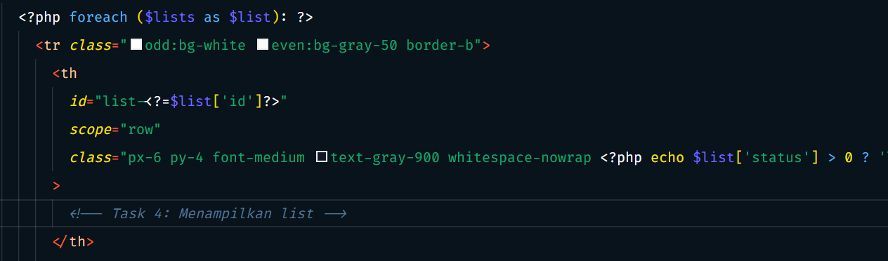
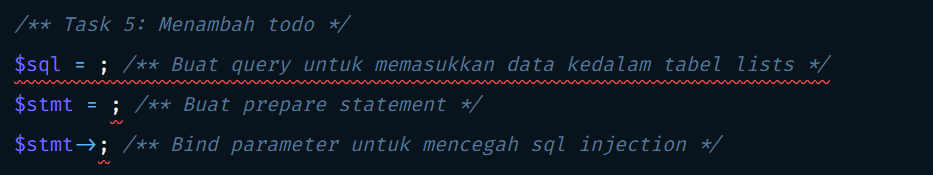
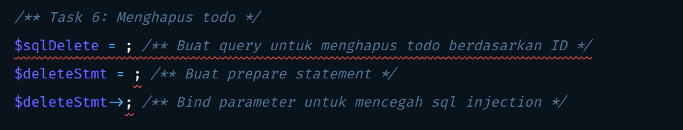
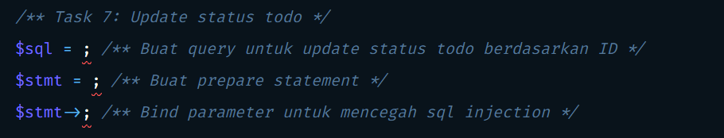

<h1 style="text-align: center;">Todolist App</h1>


## Task 1: Buat database dan table

### Buat database

Buat database baru dengan nama `todolist`

### Buat table

Buat tabel baru didalam database yang barusan dibuat, beri nama `users` dan `lists`. Pastikan tabel yang dibuat seperti schema berikut ini



##### Note

- Pastikan kolom `id` memiliki `AUTO_INCREMENT` dan `PRIMARY KEY`
- Kolom yang tipe datanya `varchar`, buat panjangnya jadi 255
- Pastikan kolom `user_id` dapat bernilai `null` (nullable)
- Pastikan kolom `status` mempunyai nilai default yaitu `0`

### Insert data

Copy sql berikut lalu paste kedalam tabel `lists`

```sql
INSERT INTO `lists` (`id`, `user_id`, `todo`, `status`)
VALUES (NULL, NULL, 'Belajar ngoding PHP', '0'),
       (NULL, NULL, 'Pelatihan AMCC', '0'),
       (NULL, NULL, 'Bikin konten', '0');
```

#### Referensi untuk mengerjakan Task 1

- https://www.w3schools.com/mysql/mysql_autoincrement.asp
- https://www.w3schools.com/mysql/mysql_primarykey.asp
- https://www.w3schools.com/mysql/mysql_create_table.asp
- https://www.w3schools.com/mysql/mysql_default.asp
- https://www.w3schools.com/mysql/mysql_foreignkey.asp

## Task 2: Buat koneksi databasse

Lengkapi konfigurasi database pada file `config.php`


#### Referensi untuk mengerjakan Task 2

- https://www.w3schools.com/php/php_mysql_connect.asp

## Task 3: Ambil semua list

Buat query untuk mendapatkan semua data `lists` pada file `index.php`


#### Referensi untuk mengerjakan Task 3

- https://www.w3schools.com/php/php_mysql_select.asp
- https://www.w3schools.com/php/func_mysqli_fetch_all.asp

## Task 4: Menampilkan list

Masih pada file `index.php`, scroll kebawah sampai bagian tabel lalu lengkapi kode yang kurang dibawah komentar


#### Referensi untuk mengerjakan Task 4

- https://www.geeksforgeeks.org/how-to-echo-html-in-php/
- https://www.delftstack.com/howto/php/php-echo-shorthand/
- https://www.w3schools.com/php/keyword_endforeach.asp

## Task 5: Menambah todo

Buat query pada file `create.php` untuk menambahkan todo baru



#### Referensi untuk mengerjakan Task 5

- https://www.w3schools.com/php/php_mysql_insert.asp
- https://www.w3schools.com/php/php_mysql_prepared_statements.asp

## Task 6: Menghapus todo

Untuk menghapus todo diperlukan query, jadi buatlah query untuk menghapus todo berdasarkan ID pada file `delete.php`


#### Referensi untuk mengerjakan Task 6

- https://www.w3schools.com/php/php_mysql_delete.asp
- https://www.w3schools.com/php/php_mysql_prepared_statements.asp

## Task 7: Update status todo

Kalau kita lihat sepertinya aplikasi kita sudah jadi, begitu kita centang maka todo-nya akan tercoret menandakan telah selesai. Namun sebenarnya itu hanyalah tampilannya saja kita harus juga meng-update status di databasenya, maka dari itu buatlah query untuk update status di database berdasarkan ID pada file `checked.php`



#### Referensi untuk mengerjakan Task 7

- https://www.w3schools.com/php/php_mysql_update.asp
- https://www.w3schools.com/php/php_mysql_prepared_statements.asp
